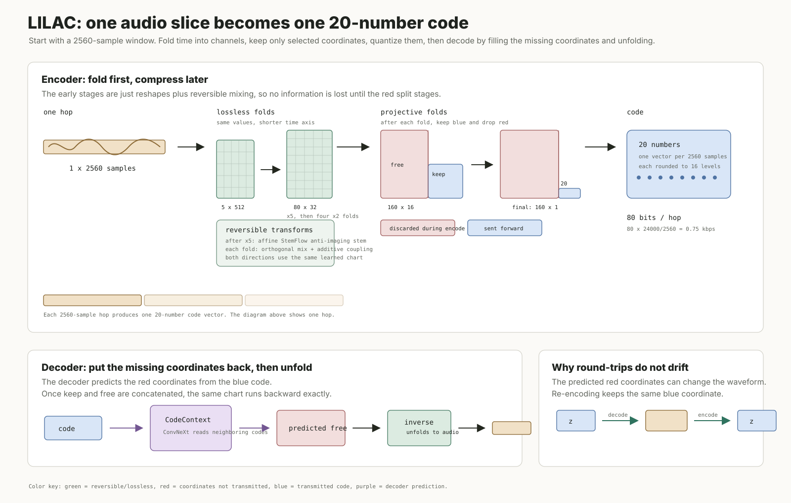

# LILAC

This repository is the small, public PyTorch reproduction of the LILAC speech
codec at **0.75 kb/s** for 24 kHz audio. It contains only the model, the
HiFiTTS-2 input pipeline, the training discriminator/objective, checkpoint/SWA
handling, and a self-check.

The rate is exact:

```
20 coordinates × 4 bits × (24,000 / 2,560) frames/s = 750 bit/s
```

The generator uses the published 5→10→20→40→80 reversible chart, five
projective stages, 20×16 finite scalar quantization, and a deterministic
coarse-to-fine fill network. A three-block invertible affine `StemFlow` acts on
the five waveform phases before the chart; this is the trainable anti-imaging
stem used by the flagship.

Because decode predicts only discarded chart coordinates and then applies the
exact inverse chart, integer codes are stable under decode/re-encode:
`encode(decode(codes)) == codes` within the audited fp32 numerical margin.



## Quickstart

```bash
uv sync

# Download the flagship checkpoint (uniform SWA of the last ten 1k-spaced
# training snapshots) and place it at checkpoints/lilac_swa10.pt:
curl -L https://huggingface.co/julianyi/lilac/resolve/main/lilac_swa10.pt \
  -o checkpoints/lilac_swa10.pt

# One-command inference: resamples the input to 24 kHz mono, encodes,
# decodes, and writes 24 kHz PCM16 output.
uv run infer.py --checkpoint checkpoints/lilac_swa10.pt \
  --input in.wav --output out.wav
```

The `--cycles` flag runs the idempotence demo: decode → re-encode `K` times,
printing whether each cycle's integer codes are bit-exact against cycle 1.

```bash
uv run infer.py --checkpoint checkpoints/lilac_swa10.pt \
  --input in.wav --output out.wav --cycles 10
```

```
cycle 1: codes bit-exact vs cycle 1
cycle 2: codes bit-exact vs cycle 1
...
cycle 10: codes bit-exact vs cycle 1
wrote out.wav | 3.08s | rms=0.1011
```

`infer.py` also loads the original JAX SWA `.npz` snapshot directly
(`--checkpoint swa10_tail_avg_k10.npz`); `convert_checkpoint.py` produces the
clean torch `.pt` used above from that same snapshot.

## Install and verify

Python 3.12 or newer and a CUDA 12.6-capable PyTorch installation are expected.

```bash
uv sync
uv run verify.py
```

The verification runs entirely in a temporary directory. It checks the frozen
rate and topology, integer-code idempotence, spectral/discriminator finiteness,
and exact continuation of the shard cursor.

## Data

Training uses the public HiFiTTS-2 24 kHz shard corpus (about 31,700 hours).
Each local shard is a pair:

```text
shard_000000.bin       # little-endian int16 mono PCM
shard_000000.idx.json  # clip offsets and lengths
```

Shards are prepared from the public HiFiTTS-2 corpus
(`nvidia/hifitts-2` on Hugging Face): download the 44.1 kHz subset,
resample each clip to 24 kHz mono, and pack the samples as little-endian
int16 PCM in the shard/index format above. The complete corpus is roughly
5 TiB packed. The loader accepts one or more local shard directories and
fails closed on malformed metadata.

Per crop, the loader reproduces the flagship quality gate (kurtosis, RMS, and
silence rejection), peak normalization, and target-preserving augmentation:
24→16→24 kHz resampling, alternate-rate resampling, low-pass filtering,
high-shelf attenuation, or no spectral transform, plus independent occasional
loudness attenuation. The transformed crop is both the input and the target.

## Train

```bash
uv run train.py my-run --data /data/hifitts2 --device cuda
```

The frozen recipe is:

- 25,600-sample crops and global batch 256;
- AdamW, generator/discriminator peaks 2e-4/1e-4, 1k linear warmup, then
  per-step exponential decay 0.999996;
- mel/MR-STFT/adversarial/feature weights 15/1/1/2, with a 5k adversarial
  warmup;
- global gradient clipping at 0.3;
- continuation updates 848001–898000 at constant 5e-5/2.5e-5;
- uniform average of checkpoints 889k–898k as `model_swa10.pt`.

On one device, gradient accumulation preserves the global batch of 256. The
global-Frobenius spectral-convergence gradient is corrected across
micro-batches rather than replaced by an unstable per-example ratio. Select a
device batch that divides 256:

```bash
uv run train.py my-run --data /data/hifitts2 \
  --device cuda --micro-batch-size 4
```

Resume only into the same run namespace:

```bash
uv run train.py my-run --data /data/hifitts2 \
  --device cuda --resume runs/my-run/latest.pt
```

`latest.pt` contains model, discriminator, both optimizer states, all process
RNG states, and the four-integer shard cursor. The trainer retains the final ten
generator snapshots needed for SWA and replaces older snapshots; archive any
intermediate checkpoints you need independently.

The original reported checkpoint was trained with JAX on TPU v6e-8. This port
reproduces the architecture, data transformations, objective, optimizer
schedule, global batch, continuation, and SWA construction; floating-point
trajectories are not expected to be bit-identical across frameworks/hardware.

## Use

```python
import torch

from config import LILACConfig
from lilac.codec import LILAC

artifact = torch.load("runs/my-run/model_swa10.pt", map_location="cpu")
model = LILAC(LILACConfig())
model.load_state_dict(artifact["generator"])
model.eval()

waveform = torch.randn(1, 1, 25_600)
codes = model.encode(waveform)       # [1, 20, 10], integer values 0..15
reconstruction = model.decode(codes) # [1, 1, 25_600]
```

## License

Apache License, Version 2.0. See [LICENSE](LICENSE).

## Citation

```bibtex
@misc{yi2026lilac,
  title={LILAC: An Idempotent Neural Speech Codec},
  author={Yi, June Young and Lee, Dongwook and Yeom, Jiheum and Yoon, Sungroh},
  year={2026},
  eprint={2608.05727},
  archivePrefix={arXiv},
  primaryClass={cs.SD}
}
```
